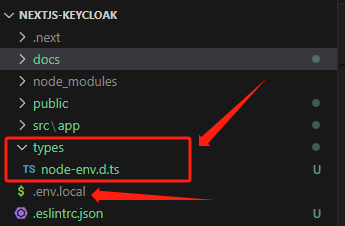
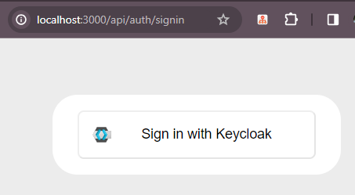
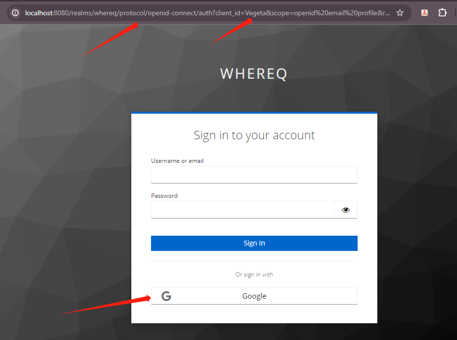
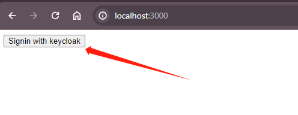
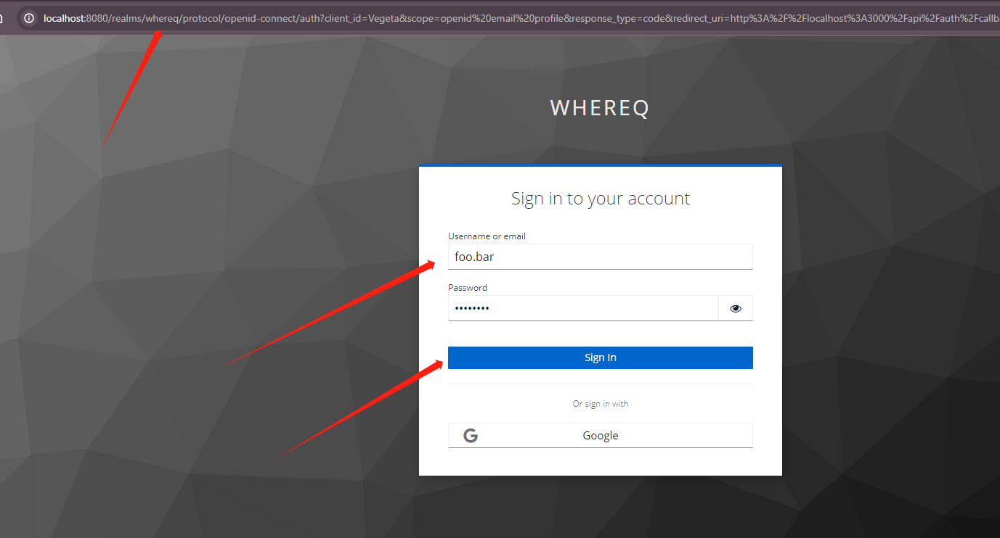
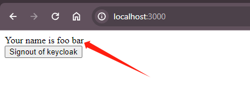

# Implementing Authentication in Next.js Application with Keycloak

## Create and Init
```bash
yarn create next-app
```

```
success Installed "create-next-app@14.1.3" with binaries:
      - create-next-app
√ What is your project named? ... nextjs-keycloak
√ Would you like to use TypeScript? ... No / Yes
√ Would you like to use ESLint? ... No / Yes
√ Would you like to use Tailwind CSS? ... No / Yes
√ Would you like to use `src/` directory? ... No / Yes
√ Would you like to use App Router? (recommended) ... No / Yes
√ Would you like to customize the default import alias (@/*)? ... No / Yes
```

## Install  [next-auth](https://next-auth.js.org/)  as a dependency 
```bash
cd nextjs-keycloak
yarn add next-auth
```
## Implementation
### 1. Extend the `ProcessEnv` interface with the following steps.
In the root of the project, create a `types` folder, and then create a file named `node-env.d.ts` within this folder.

```
mkdir types
touch types/node-env.d.ts
```
||
|:-:|
|types/node-env.d.ts in the root of the project|

- Extend the `ProcessEnv` with the code below
```typescript
// types/node-env.d.ts
declare namespace NodeJS {
  export interface ProcessEnv {
    KEYCLOAK_CLIENT_ID: string
    KEYCLOAK_CLIENT_SECRET: string
    KEYCLOAK_ISSUER: string
  }
}
```

### 2. Create `.env.local` to load environment variables
In the root of the project, create a `.env.local` file to add the environment variables defined in `types/node-env.d.ts`.

`KEYCLOAK_CLIENT_ID`, `KEYCLOAK_CLIENT_SECRET` and `KEYCLOAK_ISSUER` are configured in `Keycloak`, they will be used to fetch access token from `Keycloak`. 

`NEXTAUTH_URL` and `NEXTAUTH_SECRET` are essential for configuring of `next-auth`. 
To know more, check this [NextAuth Environment Variables](https://next-auth.js.org/configuration/options#environment-variables).
**.env.local**
```
KEYCLOAK_CLIENT_ID="Vegeta"
KEYCLOAK_CLIENT_SECRET="mPs1i3ngKZHgAnVfkf87faRBt58KzHOt"
KEYCLOAK_ISSUER="http://localhost:8080/realms/whereq"
NEXTAUTH_URL="http://localhost:3000"
NEXTAUTH_SECRET=YpeSrq7KUsCAfQFZn4txgmUO/YMkHw2VW5idf59ljaI=
```

**NOTE**: the secret `NEXTAUTH_SECRET` is used to sign and encrypt cookies, it can be created by the command below
```bash
openssl rand -base64 32
```

### 3. Configure the  `authOptions`  with  `KeycloakProvider`  for  `next-auth`  and initialize route handler.

The code below will configure Keycloak provider from the environment variables.
```typescript
// src/app/api/auth/[...nextauth]/route.ts
import { AuthOptions } from "next-auth";
import NextAuth from "next-auth";
import KeycloakProvider from "next-auth/providers/Keycloak"
export const authOptions: AuthOptions = {
  providers: [
    KeycloakProvider({
      clientId: process.env.KEYCLOAK_CLIENT_ID,
      clientSecret: process.env.KEYCLOAK_CLIENT_SECRET,
      issuer: process.env.KEYCLOAK_ISSUER
    })
  ]
}
const handler = NextAuth(authOptions);
export { handler as GET, handler as POST }
```

## The first initial test with `next-auth` native `signin` library

Run the application
```bash
yarn dev
```

Once the application started, go to [http://localhost:3000/api/auth/signin](http://localhost:3000/api/auth/signin)
**NOTE**: the route `signin` is provided by `next-auth` library  

If everything works as expected, the `next-auth` sign-in page will be shown

||
|:-:|
|The sign-in page provided by `next-auth` library|

Click the sign-in button `Sign-in with Keycloak`, the route will be redirected to `Keycloak` sign-in page
||
|:-:|
|`Keycloak` sign-in page|

### 4. Setup Basic React Server component

Let’s setup a basic server component which will show protected data when authenticated and would prompt login when unauthenticated.

Modify  `src/app/page.tsx`  with the following code.
```typescript
// src/app/page.tsx  
import { getServerSession } from 'next-auth'  
import { authOptions } from './api/auth/[...nextauth]/route'  
import Sign from './components/signin'  
import Signout from './components/signout'  
export default async function Home() {  
  const session = await getServerSession(authOptions)  
  if (session) {  
    return <div>  
      <div>Your name is {session.user?.name}</div>  
      <div><Signout /> </div>  
    </div>  
  }  
  return (  
    <div>  
      <Signin />  
    </div>  
  )  
}
```

Also create the  `Signin`  and  `Signout`  component by creating the following files.

mkdir src/app/components &&  touch src/app/components/signin.tsx && touch src/components/signout.tsx

Add the following contents to `Signin` and `Signout` component.
```typescript
// src/components/signout.tsx  
"use client"  
import { signIn } from "next-auth/react";  
export default function Signin() {  
  return <button onClick={() => signIn("keycloak")}>  
    Signin with keycloak  
  </button>  
}
```

```typescript
// src/components/Signout.tsx  
"use client"  
import { signOut } from "next-auth/react";  
export default function Signout() {  
  return <button onClick={() => signOut()}>  
    Signout of keycloak  
  </button>  
}
```

> Notice the  `_use client_`  directive . This directive is a convention to declare a boundary between a Server and Client Component module graph.

### Demo so far
- Step 1. Open the application at [http://localhost:3000/](http://localhost:3000/)
Click the sign-in button `Signin with Keycloak`, the route will be redirected to `Keycloak` sign-in page

||
|:-:|
|`Keycloak` sign-in page|


- Step 2. Sign-in in `Keycloak`
Sign in to `Keycloak` with the user `foo.bar` which has already been created in `Keycloak`. In this scenario, the `Google Provider` has also been configured in `Keycloak`, allowing you to sign in with your Google account if desired.

||
|:-:|
|Sign-in in `Keycloak`|

- Step 3. Sign-out 
Upon signing in, the name associated with the signed-in account will be displayed on the page alongside the `Signout of keycloak` button.

||
|:-:|
|Sign-out|

- Step 4. After Sign-out
Click the `Signout of keycloak` button to log out. You will then be redirected to the sign-in page.

||
|:-:|
|`Keycloak` sign-in page|


## One step futher
There is one thing that might catch your attention: at `Step 4` above, when you click the "Sign out of Keycloak" button to log out of the current account right after signed in, you will be redirected to the sign-in page. Then, if you click the "Sign in with Keycloak" button again, you will be redirected directly to `Step 3`, "Sign out of Keycloak," with your account information shown on the page. This bypasses `Step 2`, "Sign in with Keycloak." Why does this happen?

**The reason why**
This is because of the session created by Keycloak in the browser. The [`signOut`](https://next-auth.js.org/getting-started/client#signout) function provided by `NextAuth` clears the session present in the Next.js application but does not clear the session on `Keycloak`. And the default expiration time for the `accessToken` in `Keycloak` is 5 minutes, users do not need to sign in again within this time frame. Therefore, when using `next-auth` with the `Keycloak` provider, the system automatically skips the `Keycloak` sign-in process during this period. 

## Refreshing access token
### JWT session strategy
By default, `next-auth` employs a JWT session strategy. This means that all the session data required for user authentication is stored in the browser as **encrypted cookies**. The encryption of these cookies is based on the `NEXTAUTH_SECRET` configuration(**Configured in `.env.local`**). With the JWT session strategy, `next-auth` allows the storage of session data such as access tokens, refresh tokens, ID tokens, as well as session metadata like name and image, in the user's browser as encrypted cookies. This approach eliminates the need for a database to store session-related information.

### Storing tokens and session metadata in Browser side
We will utilize [callbacks](https://next-auth.js.org/configuration/callbacks), which hook into different stages of the authentication lifecycle to incorporate our specific requirements.

To achieve this, we'll include `jwt` and `session` callbacks in the `authOptions`. These callbacks will assist us in storing tokens and session metadata.

```typescript
// src/app/api/auth/[...nextauth]/route.ts
export const authOptions: AuthOptions = {
  ...
  ...
  session: {
    maxAge: 60 * 30
  },
  callbacks: {
    async jwt({ token, account }) {
      if (account) {
        token.idToken = account.id_token
        token.accessToken = account.access_token
        token.refreshToken = account.refresh_token
        token.expiresAt = account.expires_at
      }
      return token
    },
    async session({ session, token }) {
      session.accessToken = token.accessToken
      return session
    }
  }
}
```


We define the `maxAge` of the `Session` based on the default lifetime span of the refresh token in Keycloak.

Additionally, we require the `accessToken` to be renewed before its expiry. `next-auth` provides a comprehensive guide on [refresh token rotation](https://authjs.dev/guides/basics/refresh-token-rotation), which we will follow.

The `accessToken` typically has a short lifespan and needs to be refreshed before it expires. By default, the lifespan of an `accessToken` in `Keycloak` is **5** minutes.

To facilitate token renewal, we are provided with an additional token called the `refreshToken`, which has a longer lifespan. The primary purpose of the `refreshToken` is to renew or acquire a new `accessToken` until the `refreshToken` itself expires. Once the `refreshToken` reaches the end of its validity period, users of the application will need to re-authenticate with the `Keycloak` authorization server.

To implement token renewal, we will set up a `Keycloak` API call that renews the `accessToken` by using client credentials and the `refresh_token` as input parameters.

We also need to set up the JWT callback to handle scenarios where the `accessToken` has not yet expired. In such cases, we do not need to take any action. However, if the `accessToken` is about to expire (let's say within a buffer of 1 minute before its expiration), we should send a request to the Keycloak authorization server to obtain a new `accessToken`.

It's important to note that even the `refreshToken` can expire. In such cases, we would need to prompt the user to reauthenticate with the `Keycloak` authorization server.

```typescript
// src/app/api/auth/[...nextauth]/route.ts
// Keycloak API call that renews the accessToken
function requestRefreshOfAccessToken(token: JWT) {
  return fetch(`${process.env.KEYCLOAK_ISSUER}/protocol/openid-connect/token`, {
    headers: { "Content-Type": "application/x-www-form-urlencoded" },
    body: new URLSearchParams({
      client_id: process.env.KEYCLOAK_CLIENT_ID,
      client_secret: process.env.KEYCLOAK_CLIENT_SECRET,
      grant_type: "refresh_token",
      refresh_token: token.refreshToken!,
    }),
    method: "POST",
    cache: "no-store"
  });
}

export const authOptions: AuthOptions = {
// ...
  callbacks: {
    async jwt({ token, account }) {
      if (account) {
        token.idToken = account.id_token
        token.accessToken = account.access_token
        token.refreshToken = account.refresh_token
        token.expiresAt = account.expires_at
        return token
      }
      // we take a buffer of one minute(60 * 1000 ms)
      if (Date.now() < (token.expiresAt! * 1000 - 60 * 1000)) {
        return token
      } else {
        try {
          const response = await requestRefreshOfAccessToken(token)

          const tokens: TokenSet = await response.json()

          if (!response.ok) throw tokens

          const updatedToken: JWT = {
            ...token, // Keep the previous token properties
            idToken: tokens.id_token,
            accessToken: tokens.access_token,
            expiresAt: Math.floor(Date.now() / 1000 + (tokens.expires_in as number)),
            refreshToken: tokens.refresh_token ?? token.refreshToken,
          }
          return updatedToken
        } catch (error) {
          console.error("Error refreshing access token", error)
          return { ...token, error: "RefreshAccessTokenError" }
        }
      }
    },
// ...
  }
}
```
**NOTE**: The reference of `Keycloak` form parameters is listed in [References](#references) section

We'll encapsulate our components with a `SessionGuard` and `SessionProvider`, which will initiate the authentication flow if a `RefreshAccessTokenError` occurs. This wrapping is applied in the layout component so that all pages/routes are encompassed within a shared root layout containing the session guard.

The session provider ensures that the session remains active by polling the `nextjs` server every 4 minutes, with a 1-minute buffer time included in the calculation.

```typescript
// src/app/Providers.tsx
'use client'

import { SessionProvider } from "next-auth/react"
import { ReactNode } from "react"

export function Providers({ children }: { children: ReactNode }) {
  return (
    <SessionProvider refetchInterval={4 * 60}>
      {children}
    </SessionProvider>
  )
}
```

```typescript
// src/components/SessionGuard.tsx
"use client";
import { signIn, useSession } from "next-auth/react";
import { ReactNode, useEffect } from "react";

export default function SessionGuard({ children }: { children: ReactNode }) {
  const { data } = useSession();
  useEffect(() => {
    if (data?.error === "RefreshAccessTokenError") {
      signIn("keycloak");
    }
  }, [data]);

  return <>{children}</>;
}
```

```typescript
// src/app/layout.tsx
import './globals.css'
import { Providers } from './Providers'
import SessionGuard from '@/components/SessionGuard'

// ...

export default function RootLayout({
  children,
}: {
  children: React.ReactNode
}) {
  return (
    <html lang="en">
      <body className={inter.className}>
        <Providers>
          <SessionGuard>
            {children}
          </SessionGuard>
        </Providers>
      </body>
    </html>
  )
}
```

## Federated Signout
You may notice that when signing out of the application, it occurs instantaneously, and subsequent sign-ins do not prompt for a username and password. This is because of the session created by Keycloak in the browser. The [`signOut`](https://next-auth.js.org/getting-started/client#signout) function provided by `NextAuth` clears the session present in the Next.js application but does not clear the session on `Keycloak`. There is an ongoing [discussion](https://github.com/nextauthjs/next-auth/discussions/3938) in the `NextAuth` repository to implement `federated signout`, which would end the session on the provider. Until then, we will implement this functionality manually.

To sign out from `Keycloak`, we need to redirect to the following end session endpoint:

[http://localhost:8080/realms/<realm_name>/protocol/openid-connect/logout](http://localhost:8080/realms/myrealm/protocol/openid-connect/logout)

This endpoint requires the following query parameters:

1. `id_token_hint`: ID token of the user
2. `post_logout_redirect_uri`: The redirect URI post logout

Make sure to set up the `post_logout_redirect_uri` in the `Keycloak` security admin console.

Let's start by creating a `GET /api/auth/federated-signout` route, which builds the end session endpoint URL with the required query parameters.

```typescript
// src/app/api/auth/federated-signout/route.ts
function signOutParams(token: JWT): Record<string, string> {
  return {
    id_token_hint: token.idToken as string,
    post_logout_redirect_uri: process.env.NEXTAUTH_URL,
  };
}

function handleEmptyToken() {
  const response = { error: "No session present" };
  const responseHeaders = { status: 400 };
  return NextResponse.json(response, responseHeaders);
}

function sendEndSessionEndpointToURL(token: JWT) {
  const endSessionEndPoint = new URL(
    `${process.env.KEYCLOAK_ISSUER}/protocol/openid-connect/logout`
  );
  const params: Record<string, string> = signOutParams(token);
  const endSessionParams = new URLSearchParams(params);
  const response = { url: `${endSessionEndPoint.href}/?${endSessionParams}` };
  return NextResponse.json(response);
}

export async function GET(req: NextRequest) {
  try {
    const token = await getToken({ req })
    if (token) {
      return sendEndSessionEndpointToURL(token);
    }
    return handleEmptyToken();
  } catch (error) {
    console.error(error);
    const response = {
      error: "Unable to signout from the session",
    };
    const responseHeaders = {
      status: 500,
    };
    return NextResponse.json(response, responseHeaders);
  }
}
```

Create utils function in `federatedSignout.ts` 

```typescript
// src/app/utils/federatedSignout.ts
import { signOut } from "next-auth/react";

export default async function federatedSignout() {
  try {
    const response = await fetch("/api/auth/federated-signout");
    const data = await response.json();
    if (response.ok) {
      await signOut({ redirect: false });
      window.location.href = data.url;
      return;
    }
    throw new Error(data.error);
  } catch (error) {
    console.log(error)
    alert(error);
    await signOut({ redirect: false });
    window.location.href = "/";
  }
}

```
Finally, we replace the `signOut` function provided by `next-auth` with the `federatedSignout` function.

```typescript
// src/app/components/Signout.tsx
"use client"
import federatedLogout from "@/utils/federatedSignout";

export default function Signout() {
  return <button onClick={() => federatedSignout()}>
    Signout of keycloak
  </button>
}
```


## Securing pages with middleware
In our web application, we might want to keep certain routes accessible when the user is authenticated, otherwise, the user is redirected to a `sign-in` page. In this section, we will discuss the requirements and how to implement it in our application.

### Requirements:
1. If a user is authenticated, the user is able to access both public and private routes.
2. If a user is not authenticated, the user can access public routes. In case the user tries to access a private route, the user will be redirected to the `sign-in` page.
3. After a successful `sign-in`, the user is redirected back to the former private route for better user experience.
4. The redirection in requirement 2 should not be a client-side navigation, i.e., the application should not load private components on the user’s browser and then realize that the user was not authenticated. The use of `getServerSession()` would work for this purpose. However, can we do better?

Next.js provides middleware, which will run a snippet of code before processing any request. We can define routes that are protected and should be redirected to the sign-in page. Next-auth provides a middleware snippet that can be applied to selected private routes by setting up the path matcher of the route. More details on path matchers can be found [here](https://nextjs.org/docs/app/building-your-application/routing/middleware#matching-paths).


### Implementation

- Create `middleware.ts` in the root of project
```typescript
// middleware.ts
export { default } from "next-auth/middleware"

export const config = {
  matcher: ["/private"]
}
```

- Create **public** route and page
```typescript
// src/app/public/page.tsx
import { getServerSession } from 'next-auth';
import { authOptions } from '@/app/api/auth/[...nextauth]/route';
import Signout from '@/components/Signout';
import Signin from '@/components/Signin';

export default async function Public() {
  const session = await getServerSession(authOptions)
  if (session) {
    return <div className='flex flex-col space-y-3 justify-center items-center h-screen'>
      <div>You are accessing a public page</div>
      <div>Your name is {session.user?.name}</div>
      <div>
        <Signout />
      </div>
    </div>
  }
  return (
    <div className='flex flex-col space-y-3 justify-center items-center h-screen'>
      <div>You are accessing a public page</div>
      <div>
        <Signin />
      </div>
    </div>
  )
}
```

- Create **private** route and page
```typescript
// src/app/private/page.tsx
import { getServerSession } from 'next-auth';
import Signout from '@/components/Signout';
import { authOptions } from '@/app/api/auth/[...nextauth]/route';

export default async function Private() {
  const session = await getServerSession(authOptions)
  if (session) {
    return <div className='flex flex-col space-y-3 justify-center items-center h-screen'>
      <div>You are accessing a private page</div>
      <div>Your name is {session.user?.name}</div>
      <div>
        <Signout />
      </div>
    </div>
  }
}
```

### Demo for securing pages with middleware

# Terminology:
## Federated Sign-out
Federated sign-out is the situation where a user has used an external identity provider to log into `Keycloak`, and then the user logs out of that external identity provider via a workflow unknown to the application/website. When the user signs out, it will be useful for the application/website to be notified so that it can sign the user out of IdentityServer and all of the applications that use IdentityServer.

## Refresh Token
Refresh token rotation is the practice of updating an `access_token` on behalf of the user, without requiring interaction (eg.: re-sign in). `access_token`s are usually issued for a limited time. After they expire, the service verifying them will ignore the value. Instead of asking the user to sign in again to obtain a new `access_token`, certain providers support exchanging a `refresh_token` for a new `access_token`, renewing the expiry time. Let's see how this can be achieved.

# Troubleshooting:
## [Unable to connect to establish a TCP connection (ECONNREFUSED) #40702](https://github.com/nodejs/node/issues/40702)

### Issue:
```
https://next-auth.js.org/errors#signin_oauth_error connect ECONNREFUSED ::1:8080 {
  error: {
    message: 'connect ECONNREFUSED ::1:8080',
    stack: 'Error: connect ECONNREFUSED ::1:8080\n' +
      '    at TCPConnectWrap.afterConnect [as oncomplete] (node:net:1494:16)\n' +
      '    at TCPConnectWrap.callbackTrampoline (node:internal/async_hooks:130:17)',
    name: 'Error'
  },
  providerId: 'keycloak',
  message: 'connect ECONNREFUSED ::1:8080'
}
```

### Solution:
Start the server with the following options.
```
NODE_OPTIONS='--dns-result-order=ipv4first' npm run dev
```

## Type error: Type'OmitWithTag<typeof ...

### Issue:
```
.next/types/app/api/auth/[...nextauth]/route.ts:8:13
Type error: Type 'OmitWithTag<typeof import("C:/Users/googo/whereq/git/whereq-playground/JavaScript/next.js/nextjs-keycloak/src/app/api/auth/[...nextauth]/route"), "dynamic" | "config" | "generateStaticParams" | ... 12 more ... | "PATCH", "">' does not satisfy the constraint '{ [x: string]: never; }'.
  Property 'authOptions' is incompatible with index signature.
    Type 'AuthOptions' is not assignable to type 'never'.

   6 |
   7 | // Check that the entry is a valid entry
>  8 | checkFields<Diff<{
     |             ^
   9 |   GET?: Function
  10 |   HEAD?: Function
  11 |   OPTIONS?: Function
error Command failed with exit code 1.
info Visit https://yarnpkg.com/en/docs/cli/run for documentation about this command.
```

**NOTE**: This issue is only occurred when build with `next` version **14** and above.

**package.json**
```json
  "dependencies": {
    "next": "14.1.3",
    "next-auth": "^4.24.7",
    "react": "^18",
    "react-dom": "^18"
  },
```

### Solution:
[Enable the `ignoreBuildErrors` option](https://nextjs.org/docs/pages/api-reference/next-config-js/typescript)

So far I'd rather say this is a workaround instead of a solution.

If you have `next.config.mjs` in the project root folder, then

```typescript
// next.config.mjs
/** @type {import('next').NextConfig} */
const nextConfig = {
  typescript: {
    // !! WARN !!
    // Dangerously allow production builds to successfully complete even if
    // your project has type errors.
    // !! WARN !!
    ignoreBuildErrors: true,
  },
};

export default nextConfig;
```

If you have `next.config.js` in the project root folder, then

```typescript
// next.config.js
module.exports = {
  typescript: {
    // !! WARN !!
    // Dangerously allow production builds to successfully complete even if
    // your project has type errors.
    // !! WARN !!
    ignoreBuildErrors: true,
  },
}
```

# References:
[NextAuth.js Example](https://next-auth-example.vercel.app/)

[Next.js - Routing - Catch call segment](https://nextjs.org/docs/pages/building-your-application/routing/dynamic-routes#catch-all-segments)

[NextAuth Environment Variables](https://next-auth.js.org/configuration/options#environment-variables)

[Federated Sign-out](https://identityserver4.readthedocs.io/en/latest/topics/signout_federated.html#:~:text=Federated%20sign%2Dout%20is%20the,a%20workflow%20unknown%20to%20IdentityServer.)

[Refresh token rotation](https://authjs.dev/guides/basics/refresh-token-rotation)

[Keycloak request form parameters](https://www.keycloak.org/docs/latest/securing_apps/#form-parameters)

[Next.js - Routing - Matching Paths](https://nextjs.org/docs/app/building-your-application/routing/middleware#matching-paths)

[How to implement single sign-out in Keycloak with Spring Boot](https://developers.redhat.com/articles/2022/12/07/how-implement-single-sign-out-keycloak-spring-boot)

[Implementing Authentication in Next.js v13 Application with Keycloak(Part — 1)](https://medium.com/inspiredbrilliance/implementing-authentication-in-next-js-v13-application-with-Keycloak-part-1-f4817c53c7ef)

[Implementing Authentication in Next.js v13 Application with Keycloak(Part — 2)](https://medium.com/inspiredbrilliance/implementing-authentication-in-next-js-v13-application-with-Keycloak-part-2-6f68406bb3b5)