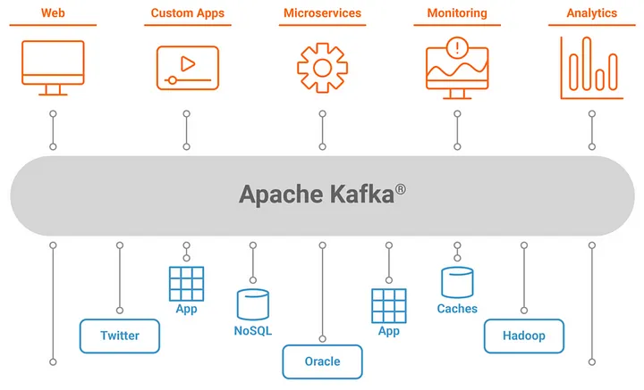
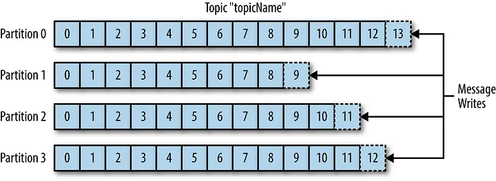
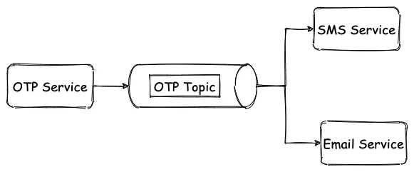
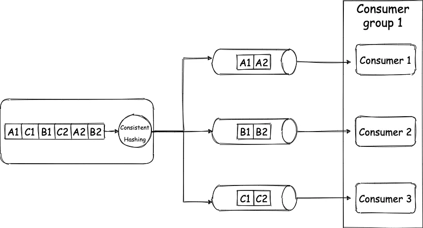
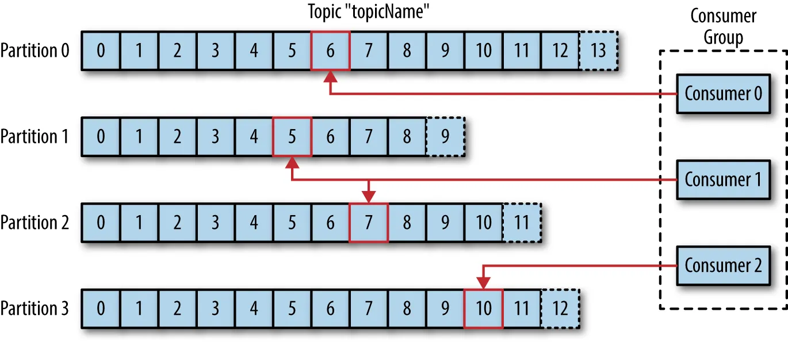
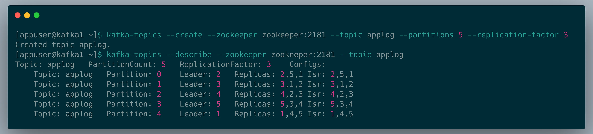

# Kafka Basics and Core concepts

||
|:-:|
|Source: [https://www.confluent.io/](https://www.confluent.io/)|

## Kafka is a Distributed Streaming Platform or a Distributed Commit Log

**Distributed**  
Kafka works as a cluster of one or more nodes that can live in different Datacenters, we can distribute data/ load across different nodes in the Kafka Cluster, and it is inherently scalable, available, and fault-tolerant.

**Streaming Platform**

Kafka stores data as a stream of continuous records which can be processed in different methods.

**Commit Log**

This one is my favorite. When you push data to Kafka it takes and appends them to a stream of records, like appending logs in a log file or if you’re from a Database background like the  [WAL](https://en.wikipedia.org/wiki/Write-ahead_logging). This stream of data can be “Replayed” or read from any point in time.


## Is Kafka a message queue?

It certainly can act as a message queue, but it’s not limited to that. It can act as a FIFO queue, as a Pub/ Sub messaging system, a real-time streaming platform. And because of the durable storage capability of Kafka, it can even be used as a Database ([read about it here](https://www.confluent.io/blog/okay-store-data-apache-kafka/)).

Having said all of that, Kafka is commonly used for real-time streaming data pipelines, i.e. to transfer data between systems, building systems that transform continuously flowing data, and building event-driven systems.

## Message

A message is the atomic unit of data for Kafka. Let’s say that you are building a log monitoring system, and you push each log record into Kafka, your log message is a JSON that has this structure.

```json
{
  "level" : "ERROR",
  "message" : "NullPointerException"
}
```

When you push this JSON into Kafka you are actually pushing 1 message. Kafka saves this JSON as a byte array, and that byte array is a message for Kafka. This is that atomic unit, a JSON having two keys “level” and “message”. But it does not mean you can’t push anything else into Kafka, you can push String, Integer, a JSON of different schema, and everything else, but we generally push different types of messages into different topics (we will get to know what is a topic soon).

Messages might have an associated “Key” which is nothing but some metadata, which is used to determine the destination partition (will know soon as well) for a message.


## Topic

Topics, as the name suggests, are the logical categories of messages in Kafka, a stream of the same type of data. Going back to our previous example of the logging system, let’s say our system generates application logs, ingress logs, and database logs and pushes them to Kafka for other services to consume. Now, these three types of logs can be logically be divided into three topics, appLogs, ingressLogs, and dbLogs. We can create these three topics in Kafka, whenever there’s an app log message, we push it to appLogs topic and for database logs, we push it to the dbLogs topic. This way we have logical segregation between messages, sort of like having different tables for holding different types of data.

## Partitions

Partition is analogous to  [shard](https://blog.yugabyte.com/how-data-sharding-works-in-a-distributed-sql-database)  in the database and is the core concept behind Kafka’s scaling capabilities. Let’s say that our system becomes really popular and hence there are millions of log messages per second. So now the node on which appLogs topic is present, is unable to hold all the data that is coming in. We initially solve this by adding more storage to our node i.e. vertical scaling. But as we all know vertical scaling has its limit, once that threshold is reached we need to horizontally scale, which means we need to add more nodes and split the data between the nodes. When we split data of a topic into multiple streams, we call all of those smaller streams the “Partition” of that topic.

||
|:-:|
|Source: Kafka The Definitive Guide|


This image depicts the idea of partitions, where a single topic has 4 partitions, and all of them hold a different set of data. The blocks you see here are the different messages in that partition. Let’s imagine the topic to be an array, now due to memory constraint we have split the single array into 4 different smaller arrays. And when we write a new message to a topic, the relevant partition is selected and then that message is added at the end of the array.

An offset for a message is the index of the array for that message. The numbers on the blocks in this picture denote the  **Offset,** the first block is at the 0th offset and the last block would on the (n-1)th offset. The performance of the system also depends on the ways you set up partitions, we will look into that later in the article. (Please note that on Kafka it is not going to be an actual array but a symbolic one)

## Producer

A producer is the Kafka client that publishes messages to a Kafka topic. Also one of the core responsibilities of the Producer is to decide which partition to send the messages to. Depending on various configuration and parameters, the producer decides the destination partition, let’s look a bit more into this.

1.  **No Key specified =>** When no key is specified in the message the producer will randomly decide partition and would try to balance the total number of messages on all partitions.
2.  **Key Specified =>** When a key is specified with the message, then the producer uses  [Consistent Hashing](https://www.toptal.com/big-data/consistent-hashing)  to map the key to a partition. Don’t worry if you don’t know what consistent hashing is, in short, it’s a hashing mechanism where for the same key same hash is generated always, and it minimizes the redistribution of keys on a re-hashing scenario like a node add or a node removal to the cluster. So let’s say in our logging system we use source node ID as the key, then the logs for the same node will always go to the same partition. This is very relevant for the order guarantees of messages in Kafka, we will shortly see how.
3.  **Partition Specified =>** You can hardcode the destination partition as well.
4.  **Custom Partitioning logic =>** We can write some rules depending on which the partition can be decided.

## Consumer

So far we have produced messages, to read those messages we use Kafka consumer. A consumer reads messages from partitions, in an ordered fashion. So if 1, 2, 3, 4 was inserted into a topic, the consumer will read it in the same order. Since every message has an offset, every time a consumer reads a message it stores the offset value onto Kafka or Zookeeper, denoting that it is the last message that the consumer read. So in case, a consumer node goes down, it can come back and resume from the last read position. Also if at any point in time a consumer needs to go back in time and read older messages, it can do so by just resetting the offset position.

## Consumer Group

A consumer group is a collection of consumers that work together to read messages from a topic. There are some very interesting concepts here, let’s go through them.

1.  **Fan out exchange =>** A single topic can be subscribed to by multiple consumer groups. Let’s say that you are building an OTP service.





Now you need to send both text and email OTP. So your OTP service can put the OTP in Kafka, and then the SMS Service consumer group and Email Service consumer group can both receive the message and can then send the SMS and email out.

2.  **Order guarantee =>** Now we have seen that a topic can be partitioned and multiple consumers can consumer from the same topic, then how do you maintain the order of messages on the consumer-end one might ask. Good question. One partition can not be read by multiple consumers in the same consumer group. This is enabled by the consumer group only, only one consumer in the group gets to read from a single partition. Let me explain.
   



So your producer produces 6 messages. Each message is a key-value pair, for key “A” value is “1”, for “C” value is “1”, for “B” value is “1”, for “C” value is “2” ….. “B” value is “2”. (Please note that by key I mean the message key that we discussed earlier and not the JSON or Map key). Our topic has 3 partitions, and due to consistent hashing messages with the same key always go to the same partition, so all the messages with “A” as the key will get grouped and the same for B and C. Now as each partition has only one consumer, they get messages in order only. So the consumer will receive A1 before A2 and B1 before B2, and thus the order is maintained, tada 🎉. Going back to our logging system example the keys are the source node ID, then all the logs for node1 will go to the same partition always. And since the messages are always going to the same partition, we will have the order of the messages maintained.

This will not be possible if the same partition had multiple consumers in the same group. If you read the same partition in the different consumers who are in different groups, then also for each consumer group the messages will end up  **_ordered_**.

So for 3 partitions, you can have a max of 3 consumers, if you had 4 consumers, one consumer will be sitting idle. But for 3 partitions you can have 2 consumers, then one consumer will read from one partition and one consumer will read from two partitions. If one consumer goes down in this case, the last surviving consumer will end up reading from all the three partitions, and when new consumers are added back, again partition would be split between consumers, this is called re-balancing.

||
|:-:|
|Source: Kafka The Definitive Guide|


## Broker

A broker is a single Kafka server. Brokers receive messages from producers, assigns offset to them, and then commit them to the partition log, which is basically writing data to disk, and this gives Kafka its  **_durable_** nature.

## Cluster

A Kafka cluster is a group of broker nodes working together to provide, scalability, availability, and fault tolerance. One of the brokers in a cluster works as the Controller, which basically assigns partitions to brokers, monitors for broker failure to do certain administrative stuff.

In a cluster, partitions are replicated on multiple brokers depending on the replication factor of the topic to have  **_failover_**  capability. What I mean is, for a topic of replication factor 3, each partition of that topic will live onto 3 different brokers. When a partition is replicated onto 3 brokers, one of the brokers will act as the leader for that partition and the rest two will be followers. Data is always written on the leader broker and then replicated to the followers. This way we do not lose data nor availability of the cluster, and if the leader goes down another leader is elected

Let’s look at a practical example. I am running a 5 node Kafka cluster locally and I run this command

```bash
kafka-topics — create — zookeeper zookeeper:2181 — topic applog — partitions 5 — replication-factor 3
```


If we break down the command, it becomes

1.  Create a topic
2.  Create 5 partitions of that topic
3.  And replicate data of all 5 partitions into a total of 3 nodes
   



This screenshot describes the topic we just created.

Let’s take Partition 0, the leader node for this partition is node 2. The data for this partition is replicated on nodes 2,5 and 1.S o one partition is replicated on 3 nodes and this behavior is repeated for all 5 partitions. And also if you see, all the leader nodes for each partition are different. So to utilize the nodes properly, the Kafka controller broker distributed the partitions evenly across all nodes. And you can also observe the replications are also evenly distributed and no node is overloaded. All of these are done by the controller Broke with the help of Zookeeper.

Since you have understood clustering now, you can see to scale we could partition a topic even more and for each partition, we could add a dedicated consumer node, and that way we can  **_horizontally scale_**.

## Zookeeper

Kafka does not function without zookeeper( at least for now, they have plans to deprecate zookeeper in near future). Zookeeper works as the central configuration and consensus management system for Kafka. It tracks the brokers, topics, and partition assignment, leader election, basically all the metadata about the cluster.


# Beyond basics

There are a few more things that are slightly advanced that you should know, I would not go into details and just touch upon, cause I don’t want to overload you with so much information in one shot.

## Producer

> **You can send messages in 3 ways to Kafka.**

-   Fire and forget
-   Synchronous send
-   Asynchronous send.

All of them have their performance vs consistency pitfalls.

> **You can configure characteristics of acknowledgment on the producer as well.**

-   ACK 0: Don’t wait for an ack |FASTEST
-   ACK 1: Consider sent when leader broker received the message |FASTER
-   ACK All: Consider sent when all replicas received the message |FAST


> **You can compress and batch messages on producer before sendig to broker.**

It gives high throughput and lowers disk usage but raises CPU usage.

> **Avro Serializer/ Deserializer**

If you use Avro as the serializer/ deserializer instead of normal JSON, you will have to declare your schema upfront but this gives better performance and saves storage.

## Consumer

> **Poll loop**

Kafka consumer constantly polls data from the broker and it’s no the other way round.

> **You can configure partition assignment strategy**

-   Range: Consumer gets consecutive partitions
-   Round Robin: Self-explanatory
-   Sticky: Tries to create minimum impact while rebalancing keeping most of the assignment as is
-   Cooperative sticky: Sticky but allows cooperative rebalancing

> **Batch size**

We can configure how many records and how much data is returned per poll call.

> **Commit offset**

On message read we can update the offset position for the consumer, this is called committing the offset. Auto commit can be enabled or the application can commit the offset explicitly. This can be done both synchronously and asynchronously.


# Ending notes

Kafka is a great piece of software and has tons of capabilities and can be used in various sets of use cases. Kafka fits great into Modern-day Distributed Systems due to it being distributed by design. It was originally founded at LinkedIn and is currently maintained by Confluent. It is used by top tech companies like Uber, Netflix, Activision, Spotify, Slack, Pinterest, Coursera. We looked into the core concepts of Kafka to get you started. There are tons of other things like Kafka Stream API or kSql that we did not talk about in the interest of time.

# References:
[Kafka Basics and Core concepts](https://medium.com/inspiredbrilliance/kafka-basics-and-core-concepts-5fd7a68c3193)
[Intro to Apache Kafka: How Kafka Works](https://www.confluent.io/blog/apache-kafka-intro-how-kafka-works/)